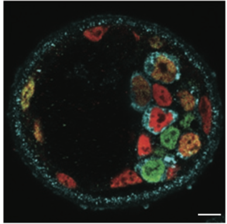
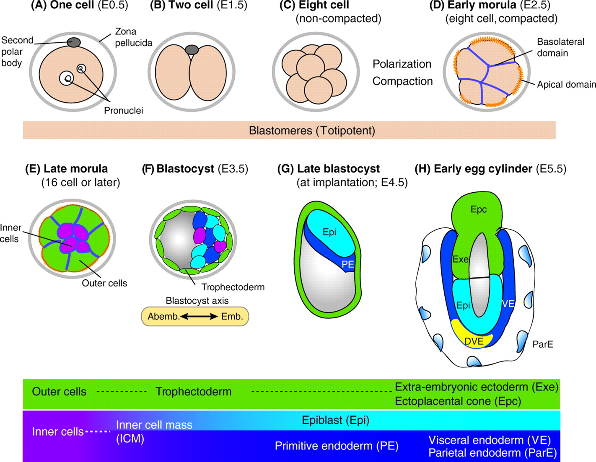

```{r setup, include=FALSE}
knitr::opts_chunk$set(echo = FALSE)
#BiocManager::install("Hiiragi2013")
library("Hiiragi2013")
library("dplyr")
library(ggplot2)
```

## Gene expression in mammalian embryonic tissues.

The following RMarkdown document explores the data from "Cell-to-cell expression variability followed by signal reinforcement progressively segregates early mouse lineages" [@Ohnishi2014].

{width=50% height=50%}


 The following graphic is from [@Rossant2009].


{width=50% height=50%}


## Modern Statistics for Modern Biology

This dataset is explored in the book Modern Statistics for Modern Biology.

### Chapter 3 - High quality graphics

<http://web.stanford.edu/class/bios221/book/Chap-Graphics.html#rgraphics:sec:exampledata>


```{r hiiragi2013, echo=TRUE}
data("x")
# Rename. Just 'x' is bad form.
esHiiragi = x; rm(list="x")
head(pData(esHiiragi))


groups = group_by(pData(esHiiragi), sampleGroup) %>%
  summarise(n = n(), color = unique(sampleColour))
groups
groupColor = setNames(groups$color, groups$sampleGroup)

ggplot(groups, aes(x = sampleGroup, y = n, fill = sampleGroup)) +
  geom_bar(stat = "identity") + # use the value of y as the bar height (this is the number of observations of the group)
  scale_fill_manual(values = groupColor, name = "Groups") + # better legend
  theme(axis.text.x = element_text(angle = 90, hjust = 1))  # rotate x axis
```


## Bibliography

The bibliography is autogenerated and appears at the end of the document.